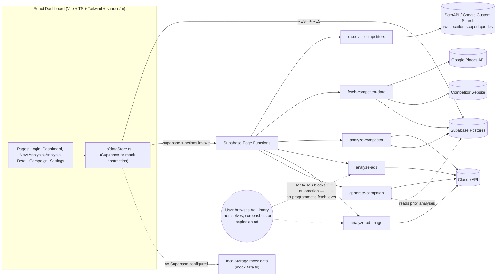

# Brand Aid — Architecture

IIT Patna · Generative AI Capstone Sprint 2026 · Batch 4
Arijit Pande · Solo Project

This document expands the Week 1 one-pager (`DesignScope_AI_1Pager.pdf`, submitted under the project's working title
"DesignScope AI" — since renamed to **Brand Aid**) into a full technical spec for the MVP build.

## 1. Problem & solution (recap)

Small and mid-sized businesses — e.g. an interior design firm competing against Livspace or HomeLane — spend hours manually
reading competitor websites, scrolling ad libraries, and guessing at strategy. Brand Aid automates the research loop:
type a niche → AI discovers competitors → auto-fetch their website + Google reviews → AI produces an evidence-backed SWOT,
positioning read, and "how to outposition them" plan → AI drafts a 7-day counter-campaign into an approval queue → everything
is saved to a dashboard and exportable as a report.

## 2. System architecture



**Why a mock-first frontend:** the dashboard is fully clickable with zero backend setup — every `dataStore.ts` function
branches on whether `VITE_SUPABASE_URL` / `VITE_SUPABASE_ANON_KEY` are set. Without them, it reads/writes a namespaced
`localStorage` object using deterministic sample data (`mockData.ts`). With them, the exact same call sites talk to
Supabase tables and Edge Functions. No UI code changes when moving from demo to production — only environment variables
and Edge Function secrets change.

## 3. Data model (ERD)

```mermaid
erDiagram
    SEARCHES ||--o{ COMPETITORS : has
    SEARCHES ||--o{ CAMPAIGNS : has
    SEARCHES ||--o{ REPORTS : has
    COMPETITORS ||--o| COMPETITOR_DATA : "1:1"
    COMPETITORS ||--o| ANALYSES : "1:1"
    COMPETITORS ||--o{ AD_EXAMPLES : has

    SEARCHES {
        uuid id PK
        uuid user_id FK
        text niche
        uuid_array selected_competitor_ids
        timestamptz created_at
    }
    COMPETITORS {
        uuid id PK
        uuid search_id FK
        text name
        text website_url
        text tier "local | national"
    }
    COMPETITOR_DATA {
        uuid competitor_id PK_FK
        text website_summary
        jsonb reviews
        numeric avg_rating
        int review_count
        text source
    }
    ANALYSES {
        uuid competitor_id PK_FK
        jsonb swot
        text positioning
        text pricing_notes
        jsonb complaint_patterns
        jsonb outposition_tips
        text source
    }
    AD_EXAMPLES {
        uuid id PK
        uuid competitor_id FK
        text pasted_text
        text messaging_angle
    }
    CAMPAIGNS {
        uuid id PK
        uuid search_id FK
        int day
        text hook
        text caption
        text creative_concept
        text status
    }
    REPORTS {
        uuid id PK
        uuid search_id FK
        text title
    }
```

Full DDL + Row Level Security policies: [`supabase/migrations/`](../supabase/migrations/) (`0001_init.sql`,
`0002_add_competitor_tier.sql`, `0003_add_campaign_creative_image.sql` — the last also provisions the public
`campaign-creatives` Storage bucket). Every table is reachable only by its owning user, traced back to
`searches.user_id = auth.uid()`.

## 4. Edge function contracts

All functions live in `supabase/functions/`, run on Deno, and are called via `supabase.functions.invoke(name, { body })`
from `lib/dataStore.ts`. The caller's JWT is forwarded automatically, so functions that touch the database run under RLS
as the authenticated user (see `_shared/supabaseClient.ts`).

| Function | Secret(s) required | Request | Response |
|---|---|---|---|
| `discover-competitors` | `SERPAPI_KEY` or `GOOGLE_CSE_KEY`+`GOOGLE_CSE_CX` | `{ niche }` | `{ competitors: { name, websiteUrl, tier }[] }` |
| `fetch-competitor-data` | `GOOGLE_PLACES_API_KEY` (with **Places API (New)** enabled) | `{ competitorId, name, websiteUrl }` | `CompetitorData` (also upserts `competitor_data`) |
| `analyze-competitor` | `ANTHROPIC_API_KEY` | `{ competitorId, niche, competitorData }` | `Analysis` (also upserts `analyses`) |
| `analyze-ads` | `ANTHROPIC_API_KEY` | `{ pastedText }` | `{ messagingAngle: string }` |
| `analyze-ad-image` | `ANTHROPIC_API_KEY` | `{ imageBase64, mediaType }` | `{ extractedText: string, messagingAngle: string }` |
| `generate-campaign` | `ANTHROPIC_API_KEY` | `{ searchId }` | `{ days: { day, hook, caption, creativeConcept }[7] }` |
| `generate-campaign-creative` | `GEMINI_API_KEY` | `{ campaignDayId }` | `{ imageUrl: string }` — generates a background image via Imagen and uploads it to the `campaign-creatives` Storage bucket; also updates `campaigns.creative_image_url` |
| `env-status` | none | *(no body)* | `{ anthropic, discovery, googlePlaces, imageGen: boolean }` — booleans only, never the secret values; drives the Settings page's Live/Demo badges |

`generate-campaign-creative` never asks the image model to render the hook text — the prompt explicitly forbids any
text/letters/logos in the generated image, since AI image models render text unreliably. The hook is overlaid as real
HTML/CSS on top of the image in `CampaignApprovalQueue.tsx` instead, so it's always crisp and correctly spelled.

`discover-competitors`, `analyze-ads`, `analyze-ad-image`, and `generate-campaign` are read-only against external APIs —
the frontend performs the corresponding table insert after receiving the response, so a partial failure never leaves an
orphaned DB row. `fetch-competitor-data` and `analyze-competitor` write directly, since their result is the row.

`discover-competitors` runs two location-scoped searches per request — `"{category} in {location}"` (biased toward local
businesses) and `"top {category} companies in {location}"` (biased toward established chains) — then dedupes by hostname
and tags each result `local` or `national` by which query surfaced it. Both queries are location-scoped, so a "national"
result still has to actually show up for that city, not just for the category nationally.

`analyze-ad-image` exists because Meta's Terms of Service prohibit automated access to the Ad Library **in any form** —
not just via their API, but via scripted browsing/scraping of the public page too. There's no compliant way to automate
that discovery step, so the user browses the Ad Library themselves (ordinary human use, not automation) and either pastes
the copy (`analyze-ads`) or uploads a screenshot they took (`analyze-ad-image`, read via Claude vision). Both keep the
"only publicly available data, gathered without automated access" guarantee from §1 intact.

## 5. Page-by-page UX flow

0. **Landing** (`/`) — public marketing page: animated hero with hook line, an illustrative animated funnel of the
   pipeline, a feature grid, and CTAs. Always visible, logged in or not — the nav/CTA labels switch to "Go to dashboard"
   once you're signed in, rather than hiding the page.
1. **Login** — Supabase email/password auth, or a local mock session when Supabase isn't configured.
2. **Dashboard** (`/dashboard`) — KPI cards, an animated **intelligence funnel** (Discovered → Selected → Analyzed →
   Ad angles read → Campaign days drafted → Days approved, computed live via `getFunnelStats()`), pipeline health
   percentages, and a table of past analyses.
3. **New Analysis** (`/new`) — a 4-step wizard:
   - Niche input (category + location, e.g. "interior design, Kolkata") → `discover-competitors`
   - Select 2–3 competitors, each tagged **Local** or **National** → stored on the search
   - Auto fetch + analyze (`fetch-competitor-data` → `analyze-competitor` per competitor, sequential with progress UI)
   - Ad Strategy Teardown (optional) — upload a screenshot of an ad (→ `analyze-ad-image`) or paste the copy directly
     (→ `analyze-ads`); either way, the user is the one who browsed the Ad Library, not the app
4. **Analysis Detail** (`/analysis/:searchId`) — comparison charts (avg rating, SWOT signal counts), then per-competitor
   sections: positioning, full SWOT, review-mined complaint patterns, "how to outposition them," ad teardown. Each
   competitor also gets a **market position** badge (Market leader / Established / Emerging / New entrant, from review
   volume) and a **growth signal** badge (Fast-growing / Steady, from what fraction of reviews are recent) — both
   computed client-side in `lib/marketSignals.ts` from data already fetched, never a separate "brand strength" API or
   invented score. Export PDF uses the browser's native print dialog (`window.print()` + a `@media print` stylesheet)
   — see §7 for why.
5. **Campaign** (`/analysis/:searchId/campaign`) — `generate-campaign` drafts 7 days; each day is a card in an approval
   queue (Approve / Reject / Reset). "Auto-post via Make.com" is shown as a disabled, labeled stretch item — not built.
6. **Settings** — live-vs-demo status per integration, required env vars / secrets, and the data-integrity policy.

Every AI- or fetch-derived value the UI renders carries a small **Live data** / **Demo data** badge
(`components/dashboard/DataSourceBadge.tsx`), so a viewer always knows whether they're looking at a real API result or
the offline demo dataset.

## 6. MVP vs. stretch scope

| In this build | Stretch (documented, not built) |
|---|---|
| Local + national competitor discovery, location-scoped | Scheduled competitor re-analysis / email digests |
| Auto site + review fetch | Auto-post via Make.com |
| SWOT, positioning, review mining, outposition tips | Any form of automated Meta Ad Library access — permanently out of |
| Ad-copy teardown: manual paste **or** screenshot + AI vision | scope, not just deferred; see §4 and §7 |
| Animated funnel / stage dashboard | Multi-tenant per-user API key storage |
| Side-by-side comparison charts | |
| 7-day campaign generator + approval queue | |
| PDF export (browser print) | |
| Supabase auth, Postgres schema, RLS | |

## 7. Notable implementation decisions

- **Tailwind v4 + shadcn/ui + Vite**, matching what Lovable itself generates — the codebase can be imported into or
  synced with Lovable without a rewrite.
- **Reviews use Places API (New), not the legacy Places endpoints.** Google now blocks the legacy `findplacefromtext` /
  `details` endpoints for most projects and pushes everyone toward `places:searchText` + `places/{id}` with an
  `X-Goog-FieldMask` header instead — different auth headers, request/response shapes, and review field names
  (`authorAttribution.displayName` instead of `author_name`, etc.). The key needs **"Places API (New)"** enabled
  specifically in Google Cloud Console — enabling just "Places API" (legacy) isn't enough.
- **Discovery results are filtered, not shown raw.** A generic web search for "top {category} in {location}" also
  surfaces forum threads, social posts, and directory/listicle pages — those are excluded by domain blocklist, and
  listicle-style titles (e.g. "100+ Best Interior Designers in Kolkata for Home") are replaced with a name derived
  from the site's own domain rather than shown as-is.
- **Market position and growth signal are thresholds on real data, explicitly labeled as estimates.** Market position
  buckets by Google review count (500+ leader, 100+ established, 20+ emerging, else new entrant); growth signal checks
  whether ≥60% of the (up to 5) reviews Google returns are from the last 6 months. Both are simple, inspectable
  heuristics rather than a proprietary "brand strength" score — deliberately, so nothing here reads as more
  authoritative than the data actually supports. The UI always shows the "estimated, not a certified ranking" caption
  next to these badges.
- **PDF export uses the browser's native print dialog, not html2canvas.** An earlier version used `html2pdf.js`
  (html2canvas + jsPDF). Tailwind v4's default palette and its opacity-modifier utilities (`bg-primary/10`, etc.) render
  via `oklch()` and `color-mix(in oklab, ...)`, which html2canvas cannot parse at all — every export threw
  `Attempting to parse an unsupported color function`. `window.print()` renders through the real browser engine, so it
  has no such limitation, produces vector-quality (selectable-text) output, and removed a ~935 KB dependency.
- **Mock-data fallback lives in the data layer, not the components.** Pages call `lib/dataStore.ts` functions and never
  branch on live-vs-mock themselves — the branch is centralized, so no page needs to change when Supabase is wired up.
- **Why there's no "AI browses the Ad Library for you" feature, and won't be.** It was considered — an agent driving a
  browser to Meta's public Ad Library page and reading it back. But Meta's Terms of Service prohibit automated access to
  their Products "using automated means (such as harvesting bots, robots, spiders, or scrapers)," and that prohibition
  doesn't carve out an exception for a single supervised session — the mechanism (software driving retrieval) is what's
  restricted, not the volume. Building that in as a repeatable product feature would mean every user's browser assistant
  automates access to Meta's platform, which is exactly the prohibited case. The screenshot + Claude-vision path
  (`analyze-ad-image`) gets the same "don't retype it" outcome without that: the human does the browsing, the AI only
  reads a picture the human already took.
- **Competitor discovery is location-scoped even for "national" results.** A single generic query like "top interior
  design companies" would surface category leaders regardless of whether they operate in the searched city. Both
  discovery queries include the location, so a competitor only appears if it plausibly has a presence there.

## 8. Setup (from zero to live)

1. `npm install` from the project root.
2. Create a Supabase project, then `supabase link` and `supabase db push` to apply both migrations in
   `supabase/migrations/`.
3. `supabase secrets set ANTHROPIC_API_KEY=... SERPAPI_KEY=... GOOGLE_PLACES_API_KEY=...` (see the table in §4 for which
   secret each function needs), then `supabase functions deploy`.
4. Copy `.env.example` to `.env` and fill in `VITE_SUPABASE_URL` / `VITE_SUPABASE_ANON_KEY` from the Supabase dashboard.
5. `npm run dev`. The Settings page will flip each integration from "Demo data" to "Live" as its secret is configured.

See [`README.md`](../README.md) for the day-to-day developer commands.
